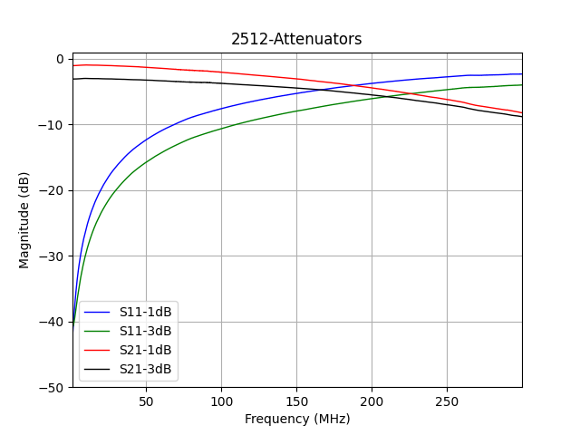

# 2512-attenuator
RF-attenuator from 1W 2512 size resistors with both BNC and SMA connectors. Works OK from DC to 30MHz. 

Measured with NanoVNA-H4 using NanoVNA saver 

---

PCB size: 71.5 x  25 x 1.6 mm

PCB Stackup: Two layer FR-4 (No impedance control) 

Traces are not 50 ohm as this is mainly for < 50 MHz use and the size of the entire PCB is thus significantly smaller than the wavelength at this frequency. 

I tried to only use resistors from the E12 series as much as possible.

This calculator was used, with the modification that i used two parallel resistors for each position for increased thermal handling and to achieve a resistance closer to the calculated values. 

[Link to RF Attenuator calculator](https://leleivre.com/rf_pipad.html)

---

Made to fit the following heat sink. 

> Heat Sink, 4.4 °C/W, TO-218, TO-220, TO-247, 42 mm, 38.1 mm, 25 mm

> Farnell Order code 1710612

---
1dB attenuator

R1  = Do Not Install (DNI) 

R2  = 2.2k

R3  = DNI

R4  = 1.5k

R5  = 12

R6  = 10

R7  =  2.2k

R8  =  1.5k

R9  = DNI

R10 = DNI 

---
2dB attenuator

R1  = DNI

R2  = 820

R3  = DNI

R4  = 1.0k

R5  = 22

R6  = 24

R7  =  1.0k

R8  =  820

R9  = DNI

R10 = DNI

---
3dB attenuator

R1  = DNI

R2  = 560

R3  = DNI

R4  = 560

R5  = 33

R6  = 39

R7  =  560

R8  =  560

R9  = DNI

R10 = DNI  

---
6dB attenuator

R1  = DNI

R2  = 270

R3  = DNI

R4  = 330

R5  = 68

R6  = 82

R7  =  270

R8  =  330

R9  = DNI

R10 = DNI  

---
10dB attenuator

R1  = DNI

R2  = 180

R3  = DNI

R4  = 220

R5  = 150

R6  = 150

R7  =  180

R8  =  220

R9  = DNI

R10 = DNI  
